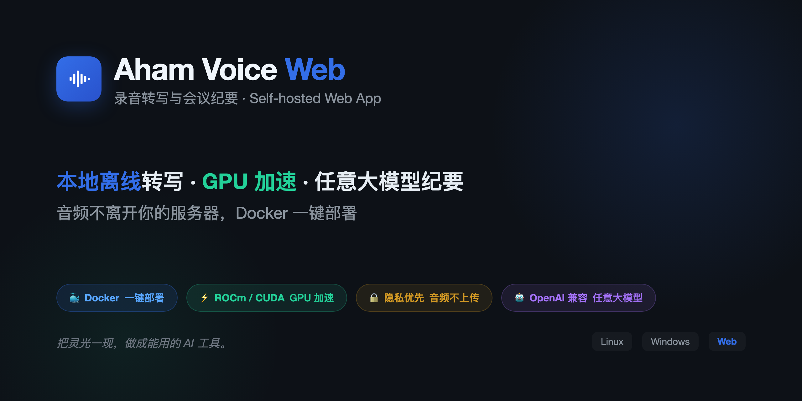

# Aham Voice Web — 录音转写与会议纪要（Linux / Windows，Docker）



> aham 系列 · 本地优先 · 自带 Key。本仓库是 [原 macOS 桌面版](https://github.com/li599198347-svg/aham-voice) 的 Web 化分支，面向 **Linux + Windows**（Docker 部署）。Mac 用户请用原 repo（支持 MPS GPU 加速）。

一个**自部署的 Web 应用**，开箱即用：

- 录音 → 转写（FunASR paraformer + VAD + 标点）→ 说话人分离（CAM++）→ 声学情绪（emotion2vec），全部本地离线（容器内）。
- 会议纪要 + 情绪语义分析走云端大模型（OpenAI 兼容端点：DeepSeek/通义/Kimi/Ollama/vLLM 等，在「设置」页填 API Key，仅存本机不回显）。
- 单用户模式：无登录多用户；可选**单密码门**（局域网共享时启用）。
- 热词在「热词」页手动增删，或用「导入 txt」批量导入。

## 三平台分工

| 平台 | 用什么 | GPU |
|---|---|---|
| **Mac** | [原 repo](https://github.com/li599198347-svg/aham-voice)（pywebview 桌面版） | MPS ✅ |
| **Linux** | 本仓库 Docker 镜像 | CUDA ✅（gpu 镜像）/ CPU |
| **Windows** | 本仓库 Docker 镜像（同一个） | CPU only |

> 为什么 Mac 用原 repo：所有 Mac 上的 Linux 容器方案（Docker / Podman / apple/container / libkrun）都无法让 PyTorch MPS 工作——MPS 需要原生 macOS Metal 调用。Mac 要 GPU 加速就必须原生跑。
>
> 为什么 Windows 接受 CPU only：Windows 原生装 FunASR 全栈（torch/funasr/CUDA 版本匹配）很折腾，而 Docker 把这些麻烦全消灭。慢一点但能跑、稳定、零配置。

## 快速开始

```bash
# 1. 克隆 + 配置
git clone <repo> aham-voice-web && cd aham-voice-web
cp .env.example .env
# 编辑 .env：设 AHAMVOICE_ACCESS_PASSWORD（局域网共享建议设）、LLM_API_KEY

# 2. 启动（首次会自动下载 ~4GB 模型，10-30 分钟）
docker compose up -d

# 3. 访问
#    浏览器打开 http://<服务器IP>:8765
#    同 Wi-Fi 的手机/平板也能访问
docker compose logs -f models  # 看模型下载进度（可选）
```

**前提**：装好 [Docker](https://docs.docker.com/get-docker/)。Linux 服务器或 Windows 的 Docker Desktop 均可。

## 配置（.env）

```bash
AHAMVOICE_HOST=0.0.0.0              # 绑定地址（0.0.0.0 = 局域网可访问）
AHAMVOICE_PORT=8765                 # 端口
AHAMVOICE_ACCESS_PASSWORD=          # 空=裸奔；非空=启用单密码门
AHAMVOICE_HOME=/data                # 数据目录（SQLite + 录音，volume 挂载）
AHAMVOICE_MODELS_DIR=/models        # 模型目录（volume 挂载，首次自动下载）
LLM_API_KEY=                         # 纪要/情绪用（OpenAI 兼容端点；也可运行时在设置页填）
LLM_API_BASE=https://api.deepseek.com  # 默认 DeepSeek，可改通义/Kimi/Ollama 等
LLM_MODEL=deepseek-v4-pro            # 旧名 DEEPSEEK_* 仍可读（向后兼容）
AHAMVOICE_ASR_DEVICE=cpu            # cpu（latest 镜像）/ cuda（gpu 镜像）
```

## GPU 加速（Linux + NVIDIA）

默认 `:latest` 是 CPU 版。有 NVIDIA GPU 的 Linux 服务器可用 gpu 镜像加速转写：

1. 装 [nvidia-container-toolkit](https://docs.nvidia.com/datacenter/cloud-native/container-toolkit/)
2. 改 `docker-compose.yml`：`image: aham-voice-web:gpu`、`dockerfile: Dockerfile.gpu`，取消 `deploy.resources` 注释
3. `.env` 设 `AHAMVOICE_ASR_DEVICE=cuda`
4. `docker compose up -d --build`

## 模型

5 个模型共约 4GB，首次启动自动从 ModelScope 下载到 `./models/` volume：

- `speech_fsmn_vad_zh-cn-16k-common-pytorch`（VAD）
- `punc_ct-transformer_cn-en-common-vocab471067-large`（标点）
- `speech_seaco_paraformer_large_asr_nat-zh-cn-16k-common-vocab8404-pytorch`（ASR）
- `speech_campplus_sv_zh-cn_16k-common`（说话人分离）
- `emotion2vec_plus_large`（声学情绪）

下载进度写 stdout：`docker compose logs -f`。下载一次后持久化在 volume，重启容器不重下。

## 单密码门

`.env` 设 `AHAMVOICE_ACCESS_PASSWORD=你的密码` 即启用。浏览器访问先跳登录页输密码，登录后 cookie 有效（重启服务需重新登录）。未设则裸奔（仅本机/可信网络用）。

> 单密码门只能挡随机路人，非高安全。HTTP 明文下密码可被同网嗅探——高安全场景请在前面加反向代理 + TLS。

## 架构

```
backend/app/
├── main.py          # FastAPI app + 路由 + startup + 静态托管（前端 dist）
├── config.py        # 路径常量、env、LLM 配置（OpenAI 兼容）
├── state.py         # 模块级共享状态（锁/模型单例/单用户身份）
├── db.py            # SQLite 连接、schema、迁移、中断恢复、task helper
├── security.py      # 单密码门（cookie token + middleware）
├── deepseek.py      # LLM 传输层（OpenAI 兼容端点调用）
├── asr.py           # FunASR 转写 + 语义段合并（枢纽）
├── hotwords.py      # 热词多维打分 + 双轨包 + ASR 可说性过滤
├── voiceprint.py    # 声纹多采样匹配 + 说话人合并
├── emotion.py       # emotion2vec 声学层 + LLM 语义层
├── summary.py       # 会议纪要分块 map-reduce + 模板 + 改写
├── model_download.py # 首次启动模型检测/下载
└── routes/auth.py   # 单密码登录路由
frontend-src/        # 前端源码（React + Vite + TS + Tailwind v4 + Aham 设计系统）
frontend/dist/       # 前端构建产物（被跟踪；后端单进程托管 + SPA fallback）
Dockerfile.cpu       # CPU 镜像（linux/amd64 + arm64）
Dockerfile.gpu       # GPU 镜像（linux/amd64 + CUDA）
docker-compose.yml   # volume 挂载 models/data + restart 策略
```

数据目录（容器内 `/data`，volume 挂载）：SQLite 数据库、录音文件、导出。

## 本地开发

```bash
# 后端（venv，改 Python 即生效）
python -m venv .venv && source .venv/bin/activate
pip install -r backend/requirements.txt   # 轻量依赖（fastapi/uvicorn/dotenv）
# 完整 ASR 测试需：pip install -r backend/requirements-asr.txt（torch/funasr，重型）
AHAMVOICE_HOME=/tmp/aham-dev python -m uvicorn backend.app.main:app --port 8765 --reload

# 前端（改 TS 热更新）
cd frontend-src && npm install && npm run dev   # Vite 跑 5174，已配 /api 代理到 8765
```

测试：`pip install pytest httpx && python -m pytest backend/tests/`

## 主要 API

| 路由 | 用途 |
|---|---|
| `POST /api/auth/login` | 单密码登录（密码门启用时） |
| `GET /api/health` | 健康检查（密码门白名单） |
| `GET /api/me` | 当前（固定本机）用户 |
| `GET/PATCH /api/settings` | 大模型 API Key / Base / 模型 |
| `GET/POST /api/recordings` | 录音列表 / 上传 |
| `GET /api/recordings/{id}` | 录音详情（逐字稿/纪要/说话人/情绪） |
| `POST /api/recordings/{id}/summarize` | 大模型生成纪要 |
| `POST /api/recordings/{id}/summary/revise` | 按自然语言重写纪要 |
| `POST /api/recordings/{id}/emotion` | 情绪语义分析 |
| `GET/POST/PATCH/DELETE /api/hotwords` | 热词增删改查 |
| `POST /api/hotwords/import` | 从 txt 批量导入热词 |
| `GET/POST/PATCH /api/voiceprints` | 声纹管理 |

## 热词 txt 导入格式

`#` 开头与空行忽略；其余每行是一个热词，两种写法：

- 纯词：`帕萨思`
- 扩展（英文逗号分隔，最多 4 段）：`词,别名(多个用分号;隔),类型,权重`
  例：`金蝶接口,金蝶API;金蝶系统,产品,9`

`词` 必填，其余可选（默认 类型=术语、权重=8）。已存在的词（不区分大小写）与文件内重复项自动跳过。

## 关于 Aham

> **把灵光一现，做成能用的 AI 工具。**

Aham 来自 *aha moment*。每个工具只把一件事做利落。详见 [原项目](https://github.com/li599198347-svg/aham-voice#关于-aham)。
